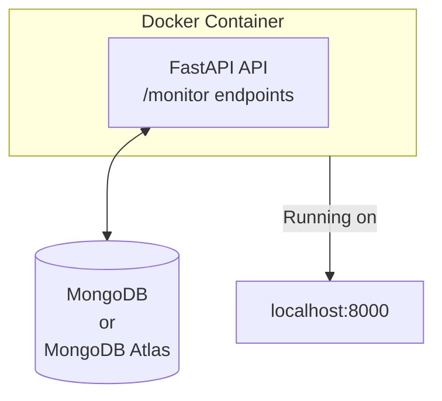

# FastOps-Agent
A **cloud-native DevOps automation and monitoring platform** built using:


It provides REST APIs for collecting and storing system metrics from distributed agents, automates server management tasks, and runs on a scalable multi-node Docker Swarm cluster.
The project demonstrates end-to-end DevOps skills — containerization, orchestration, API design, cloud deployment, and secure configuration management using MongoDB Atlas.

## Local Prototype (FastAPI + MongoDB + Docker Compose)

---
## Overview
**FastOps-Agent** is a cloud-native **automation and monitoring** platform built to showcase real DevOps skills.

Phase 1 delivers the project’s local prototype — a containerized backend system using `FastAPI` and `MongoDB` (or Mongo Atlas) to store system metrics.
This forms the foundation for later phases involving agents, Swarm orchestration, AWS deployment, and CI/CD automation.

---
## Objectives of Phase 1
- Build a REST API with FastAPI (✔) 
- Store server metrics in MongoDB (✔) 
- Run all services locally with Docker Compose (✔) 
- Secure secrets using .env files (✔) 
- Test endpoints using curl or Postman (✔) 

---
## Architecture Diagram


---
## Tech Stack


| Component | Purpose |
|------------|----------|
| **FastAPI** | REST API backend |
| **Motor** | Asynchronous MongoDB driver for FastAPI |
| **MongoDB / MongoDB Atlas** | Persistent metrics database |
| **Docker Compose** | Local container orchestration and service networking |
| **Python 3.12** | Application runtime environment |

---

## Folder Structure
FastOps-Agent/
├── docker-compose.yml
├── .env
├── .gitignore
├── fastapi-api/
│   ├── Dockerfile
│   ├── requirements.txt
│   └── app/
│       ├── main.py
│       ├── api/
│       │   └── monitor.py
│       ├── db/
│       │   └── mongo_client.py
│       └── schemas.py
└── README.md

## Docker Compose Configuration
`docker-compose.yml`
```bash
services:
  api:
    build: ./fastapi
    env_file:
      - .env
    ports:
      - "8000:8000"
```

---
## How to Run (Locally)
```bash
# 1  Build and start
docker compose up --build

# 2  Check running containers
docker ps

# 3  Visit API
http://localhost:8000

```

---
## Next Phase — Agent Development

**Phase 2** introduces the **CloudOps Agent**, a lightweight Python service that:

-  **Collects system metrics** using the [`psutil`](https://pypi.org/project/psutil/) library  
-  **Sends data periodically** to your `/monitor/ingest` FastAPI endpoint  
-  **Simulates multiple nodes** reporting metrics to your central backend control center  

---

###  Goal

> Build the **distributed monitoring component** that feeds real-time server data into your FastAPI + MongoDB backend, enabling centralized visibility and automation.

### Development Roadmap
| Phase | Description | Status |
|:------|:-------------|:------:|
| 🩵 **Phase 1** | Local Prototype – FastAPI + MongoDB + Docker Compose | ✅ Completed |
| 💙 **Phase 2** | Agent Development | 🔜 Next |
| 💜 **Phase 3** | Swarm Deployment (AWS EC2) | ⏳ Planned |
| ❤️ **Phase 4** | Cloud Polish + Dashboard + SSL | ⏳ Planned |
